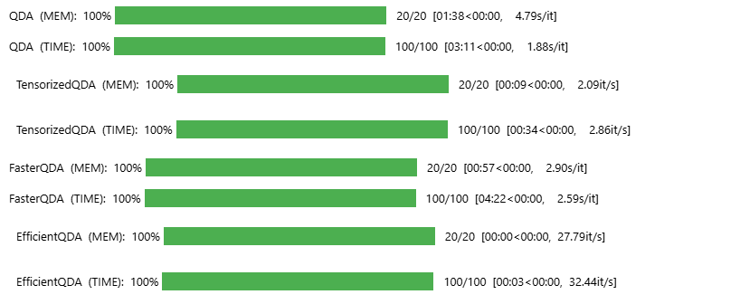

# Consigna QDA

**Notación**: en general notamos

* $k$ la cantidad de clases
* $n$ la cantidad de observaciones
* $p$ la cantidad de features/variables/predictores

**Sugerencia:** combinaciones adecuadas de `transpose`, `stack`, `reshape` y, ocasionalmente, `flatten` y `diagonal` suele ser más que suficiente. Se recomienda *fuertemente* explorar la dimensionalidad de cada elemento antes de implementar las clases.

# Respuestas

Para todas las respuestas vamos a respetar la notación propuesta. El dataset que utilizaremos será el de vinos, via la función `get_wine_dataset()`. El mismo tiene la siguiente distribución:
- $k$ clases: 3
- $p$ features: 13
- $n$ observaciones: 178

## Tensorización

En esta sección nos vamos a ocupar de hacer que el modelo sea más rápido para generar predicciones, observando que incurre en un doble `for` dado que predice en forma individual un escalar para cada observación, para cada clase. Paralelizar ambos vía tensorización suena como una gran vía de mejora de tiempos.

### 1) Diferencias entre `QDA`y `TensorizedQDA`

1. ¿Sobre qué paraleliza `TensorizedQDA`? ¿Sobre las $k$ clases, las $n$ observaciones a predecir, o ambas?

TensorizedQDA paraleliza sobre las k clases. Ambos recorren las observaciones de la misma forma. Pero una vez que se obtienen las matrices de covarianzas, las apila para todas las clases a la vez usando `np.stack`
Por ejemplo, usando el dataset de vinos, queda (3, 13, 13) donde:

- 3 es por las k clases
- 13, 13 es por la matriz de covarianza de los features


En conclusión, en `QDA` las $k$ matrices de covarianza viven separadas en una lista, entonces no queda otra que visitarlas una por una. `TensorizedQDA` las "junta" en un único objeto 3D, y eso le permite a numpy hacer todos los productos en paralelo en lugar de un loop.

2. Analizar los shapes de `tensor_inv_covs` y `tensor_means` y explicar paso a paso cómo es que `TensorizedQDA` llega a predecir lo mismo que `QDA`.

`tensor_inv_cov` tiene shape $(k, p, p)$ y `tensor_means` shape $(k, p, 1)$, para el caso del dataset de vinos los shapes son:

```py
self.tensor_inv_cov.shape
(3, 13, 13)
self.tensor_means.shape
(3, 13, 1)
```
A la hora de calcular `_predict_log_conditionals` toma cada observación $x$ con sus features y le resta los sesgos tensorizados antes de hacer el producto matricial con la matrices de covarianza tensorizadas. Por broadcasting, el tensor resuelve en paralelo el mismo vector de observación para las $k$ categorías. Por lo tanto, evita tener que predecir en loop. El producto matricial termina siendo de `(3,1,1)`: un escalar para cada clase.

### 2) Optimización

Debido a la forma cuadrática de QDA, no se puede predecir para $n$ observaciones en una sola pasada (utilizar $X \in \mathbb{R}^{p \times n}$ en vez de $x \in \mathbb{R}^p$) sin pasar por una matriz de $n \times n$ en donde se computan todas las interacciones entre observaciones. Se puede acceder al resultado recuperando sólo la diagonal de dicha matriz, pero resulta ineficiente en tiempo y (especialmente) en memoria. Aún así, es *posible* que el modelo funcione más rápido.

> Para esta sección usamos el dataset de cartas dado que, por su magnitud, era el único donde podíamos observar diferencias:
- $k$ clases: 3
- $p$ features: 13
- $n$ observaciones: 14000

3. Implementar el modelo `FasterQDA` (se recomienda heredarlo de `TensorizedQDA`) de manera de eliminar el ciclo for en el método predict.

```py
class FasterQDA(TensorizedQDA):
    def predict(self, X):
            unbiased_X = X[np.newaxis, :, :] - self.tensor_means
            temp1 = unbiased_X.transpose(0, 2, 1) @ self.tensor_inv_cov
            
            full_matrix = temp1 @ unbiased_X
            
            # np.diagonal extrae la diagonal con axis1 y axis2
            quadratic = np.diagonal(full_matrix, axis1=1, axis2=2)
            
            log_det = 0.5 * np.log(LA.det(self.tensor_inv_cov))[:, np.newaxis]
            log_post = self.log_a_priori[:, np.newaxis] + log_det - 0.5 * quadratic
            
            return np.argmax(log_post, axis=0).reshape(1, -1)
```

4. Mostrar dónde aparece la mencionada matriz de $n \times n$, donde $n$ es la cantidad de observaciones a predecir.

La matriz de $n\times n$ es `full_matrix = temp1 @ unbiased_X`

5. Demostrar que
$$
diag(A \cdot B) = \sum_{cols} A \odot B^T = np.sum(A \odot B^T, axis=1)
$$ es decir, que se puede "esquivar" la matriz de $n \times n$ usando matrices de $n \times p$. También se puede usar, de forma equivalente,
$$
np.sum(A^T \odot B, axis=0).T
$$
queda a preferencia del alumno cuál usar.

---
Tomemos matrices pequeñas, por ejemplo 2x2:

$$A = \begin{pmatrix} 1 & 2 \\ 3 & 4 \end{pmatrix} \quad B = \begin{pmatrix} 5 & 6 \\ 7 & 8 \end{pmatrix}$$

*Lado izquierdo:* $diag(A \cdot B)$

$$A \cdot B = \begin{pmatrix} 1\cdot5+2\cdot7 & \cdots \\ \cdots & 3\cdot6+4\cdot8 \end{pmatrix} = \begin{pmatrix} 19 & \cdots \\ \cdots & 50 \end{pmatrix}$$

$$diag(A \cdot B) = \begin{pmatrix} 19 \\ 50 \end{pmatrix}$$

*Lado derecho:* $\sum_{cols} A \odot B^T$

$$B^T = \begin{pmatrix} 5 & 7 \\ 6 & 8 \end{pmatrix}$$

$$A \odot B^T = \begin{pmatrix} 1\cdot5 & 2\cdot7 \\ 3\cdot6 & 4\cdot8 \end{pmatrix} = \begin{pmatrix} 5 & 14 \\ 18 & 32 \end{pmatrix}$$

$$\sum_{cols} = \begin{pmatrix} 5+14 \\ 18+32 \end{pmatrix} = \begin{pmatrix} 19 \\ 50 \end{pmatrix} \checkmark$$
---

6. Utilizar la propiedad antes demostrada para reimplementar la predicción del modelo `FasterQDA` de forma eficiente en un nuevo modelo `EfficientQDA`.

```py
class EfficientQDA(TensorizedQDA):
    def predict(self, X):
        unbiased_X = X - self.tensor_means 
        temp = self.tensor_inv_cov @ unbiased_X 
        quadratic_terms = (unbiased_X * temp).sum(axis=1) 
        
        log_det = 0.5 * np.log(LA.det(self.tensor_inv_cov))[:, np.newaxis]
        log_post = self.log_a_priori[:, np.newaxis] + log_det - 0.5 * quadratic_terms
        
        return np.argmax(log_post, axis=0).reshape(1, -1)
```
7. Comparar la performance de las 4 variantes de QDA implementadas hasta ahora (no Cholesky) ¿Qué se observa? A modo de opinión ¿Se condice con lo esperado?



La mejora del `TensorizedQDA` respecto a `QDA` es clara. Sin embargo, resulta que el `FasterQDA` es en efecto mucho más pesado en memoria pero también lo es en tiempo. El `EfficientQDA` es mucho más eficiente en ambos casos. Se condice con lo esperado porque FasterQDA a pesar de  eliminar el ciclo for se sigue construyendo la matriz n×n, generando un cuello de botella en memoria que impacta negativamente en el tiempo de ejecución.

## Cholesky

Hasta ahora todos los esfuerzos fueron enfocados en realizar una predicción más rápida. Los tiempos de entrenamiento (teóricos al menos) siguen siendo los mismos o hasta (minúsculamente) peores, dado que todas las mejoras siguen llamando al método `_fit_params` original de `QDA`.

La descomposición/factorización de [Cholesky](https://en.wikipedia.org/wiki/Cholesky_decomposition#Statement) permite factorizar una matriz definida positiva $A = LL^T$ donde $L$ es una matriz triangular inferior. En particular, si bien se asume que $p \ll n$, invertir la matriz de covarianzas $\Sigma$ para cada clase impone un cuello de botella que podría alivianarse. Teniendo en cuenta que las matrices de covarianza son simétricas y salvo degeneración, definidas positivas, Cholesky como mínimo debería permitir invertir la matriz más rápido.

*Nota: observar que calcular* $A^{-1}b$ *equivale a resolver el sistema* $Ax=b$.

### 3) Diferencias entre implementaciones de `QDA_Chol`

8. Si una matriz $A$ tiene fact. de Cholesky $A=LL^T$, expresar $A^{-1}$ en términos de $L$. ¿Cómo podría esto ser útil en la forma cuadrática de QDA?
7. Explicar las diferencias entre `QDA_Chol1`y `QDA` y cómo `QDA_Chol1` llega, paso a paso, hasta las predicciones.
8. ¿Cuáles son las diferencias entre `QDA_Chol1`, `QDA_Chol2` y `QDA_Chol3`?
9. Comparar la performance de las 7 variantes de QDA implementadas hasta ahora ¿Qué se observa?¿Hay alguna de las implementaciones de `QDA_Chol` que sea claramente mejor que las demás?¿Alguna que sea peor?

### 4) Optimización

12. Implementar el modelo `TensorizedChol` paralelizando sobre clases/observaciones según corresponda. Se recomienda heredarlo de alguna de las implementaciones de `QDA_Chol`, aunque la elección de cuál de ellas queda a cargo del alumno según lo observado en los benchmarks de puntos anteriores.
13. Implementar el modelo `EfficientChol` combinando los insights de `EfficientQDA` y `TensorizedChol`. Si se desea, se puede implementar `FasterChol` como ayuda, pero no se contempla para el punto.
13. Comparar la performance de las 9 variantes de QDA implementadas ¿Qué se observa? A modo de opinión ¿Se condice con lo esperado?